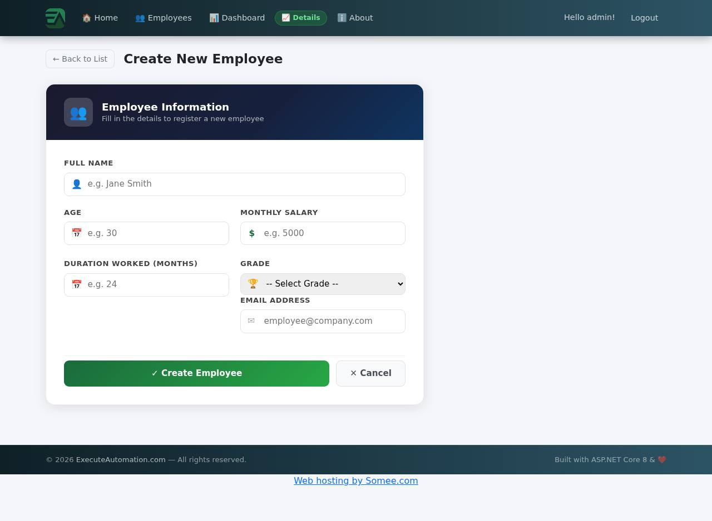
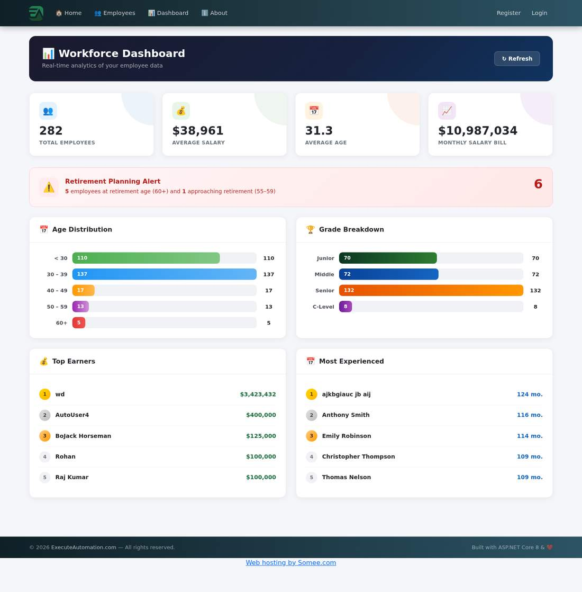
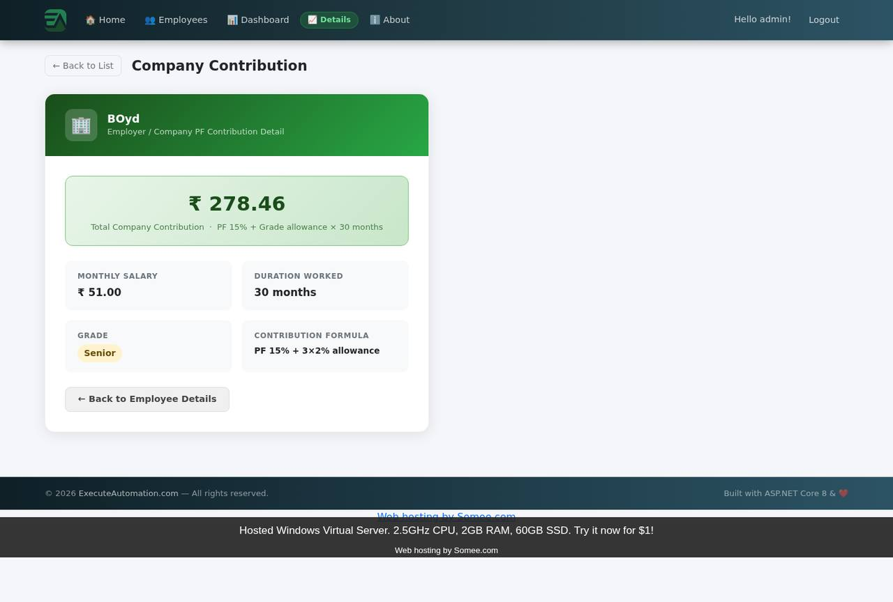
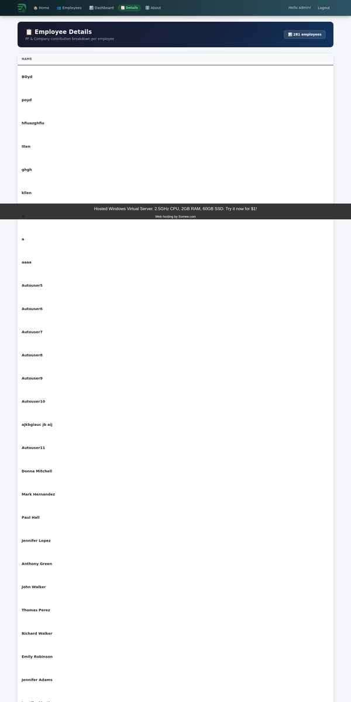

# EA Employee App — Full QA Regression (functional · security · data · accessibility)

Automated functional regression against **https://eaapp.somee.com** (ExecuteAutomation Employee App — ASP.NET Core 8 + EF Core + Identity).

| | |
|---|---|
| Application under test | https://eaapp.somee.com |
| Run started | 06 Aug 2026, 13:59 NZST |
| Duration | 335s |
| Runner | Playwright + Chromium (headless, 1440×900), one isolated browser context per test |
| Tests | **77** |
| Passed | **68** |
| Failed | **9** |
| Errors | 0 |
| Skipped | 0 |
| Evidence | full-page screenshot at each failure + screen recording of each failing workflow |

**Open findings by severity:** High 1 · Medium 4 · Low 4

## Coverage by area

| Area | Tests | Passing |
|------|-------|---------|
| Accessibility | 2 | 1/2 |
| Auth | 9 | 8/9 |
| Authorization | 7 | 6/7 |
| Business rule | 1 | 1/1 |
| CSRF | 1 | 1/1 |
| Consistency | 1 | 0/1 |
| Create | 3 | 3/3 |
| Dashboard | 1 | 1/1 |
| Data integrity | 3 | 3/3 |
| Delete | 2 | 2/2 |
| Details | 1 | 1/1 |
| Edit | 2 | 2/2 |
| Employee list | 1 | 1/1 |
| Filter | 4 | 4/4 |
| Hygiene | 1 | 1/1 |
| Injection | 2 | 2/2 |
| Links | 1 | 1/1 |
| Navigation | 1 | 1/1 |
| PF | 3 | 2/3 |
| Pagination | 3 | 3/3 |
| Performance | 3 | 2/3 |
| Responsive | 2 | 2/2 |
| Robustness | 3 | 3/3 |
| SEO | 1 | 1/1 |
| Search | 3 | 3/3 |
| Session | 4 | 3/4 |
| Transport | 3 | 1/3 |
| UI | 2 | 2/2 |
| Validation | 5 | 5/5 |
| XSS | 2 | 2/2 |

## Failures at a glance

| # | Severity | Test | What happened | Evidence |
|---|---|---|---|---|
| SEC10 | High | Logout invalidates the session server-side | the authentication cookie still grants access to the admin create form after logout — signing out does not invalidate the session server-side | [video](videos/SEC10-small.mp4) · [shot 1](screenshots/SEC10-cookie-replay.jpg) |
| SEC06 | Medium | Dashboard is not exposed anonymously | the management dashboard and its aggregate salary figures render for an anonymous visitor (HTTP 200, landed on https://eaapp.somee.com/Home/Dashboard) | [video](videos/SEC06-small.mp4) · [shot 1](screenshots/SEC06-anon-dashboard.jpg) |
| SEC12 | Medium | Baseline browser security headers | responses carry none of the standard browser-hardening headers — missing: x-content-type-options (MIME-sniffing protection); x-frame-options / content-security-policy (clickjacking protection); strict-transport-security (HTTPS enforcement (HSTS)); referrer-policy (referrer leakage control); content-security-policy (content injection control) | [video](videos/SEC12-small.mp4) |
| SEC17 | Medium | Repeated failed logins are throttled or locked out | six consecutive failed logins for the admin account triggered no lockout, throttling or CAPTCHA, and the account remained usable immediately after — credential stuffing is unthrottled | [video](videos/SEC17-small.mp4) |
| TC19b | Medium | Company contribution matches its printed formula | company contribution ₹278.46 contradicts the formula printed on the same page (PF 15% + 3×2% = 21% × 51.0 × 30 months = 321.3); the value implies an effective rate of 18.2% | [video](videos/TC19b-small.mp4) · [shot 1](screenshots/TC19b-bonus-formula-mismatch.jpg) |
| A11Y01 | Low | Document language, title and heading structure | document-level accessibility gaps: /Employee: no <h1> heading; duplicate page titles across screens: ['Sign In — EA Employee App'] | [video](videos/A11Y01-small.mp4) |
| OPS04 | Low | Responses are compressed | the employee list is served uncompressed (23884 bytes, no Content-Encoding) even though the client advertised gzip/br | [video](videos/OPS04-small.mp4) |
| SEC13 | Low | No server/framework version disclosure | the server advertises its stack in response headers: server: Microsoft-IIS/10.0, x-powered-by: ASP.NET — version disclosure helps an attacker target known CVEs | [video](videos/SEC13-small.mp4) |
| TC19c | Low | Salary currency symbol is consistent across screens | salary is rendered as $ on the employee list but $/₹ on the details/PF screens — same field, two currencies | [video](videos/TC19c-small.mp4) · [shot 1](screenshots/TC19c-currency-list.jpg) |

## Scope of this run

This pass was designed as a full QA architecture review rather than a happy-path regression. On top of the 25 functional tests, the suite now exercises ten more layers: authorization and role separation, session and cookie handling, transport and security headers, CSRF, injection and XSS, input boundaries, account/registration policy, business-logic and data integrity, HTTP/performance/link health, and accessibility. Every seeded record is deleted by a hygiene test at the end of the run.

## Corrections carried forward

Two defects reported in the original manual pass are **not** application faults and stay refuted: the "grade filter returns unfiltered results" report came from requesting `?gradeFilter=Junior` when the control binds numeric values (`1`–`4`), and the "edits never persist" report came from clicking the page's first submit button, which belongs to the header's Logout form. Both areas now pass under automation — the grade filter is verified against all four grades (BIZ01), and edit persistence is verified field-by-field (TC16, BIZ05).

Two findings from this run were also self-corrected before publication: a non-numeric-salary test that failed on the browser's own `input[type=number]` guard (rewritten to post the value directly to the server, which rejects it) and a pagination-overlap test that keyed rows by employee name (the shared instance genuinely holds distinct employees with identical names — it now keys by record id and passes).

## Full results

| # | Area | Test | Steps | Expected | Actual | Result |
|---|------|------|-------|----------|--------|--------|
| TC01 | Navigation | Home page loads with primary navigation | Open / | Landing page renders with Home / Employees / About navigation | Home page rendered; title='Home - EAEmployee'; nav present | ✅ Pass |
| TC02 | Employee list | Employee list renders with record count | Open /Employee | Table of employees plus a total count | 281 employees reported, 5 rows on page 1 | ✅ Pass |
| TC03 | Search | Search by an existing employee name | Search the first listed name | That employee's row is returned | search 'BOyd' -> row returned (gruity@gmail.com) | ✅ Pass |
| TC04 | Search | Search is case-insensitive | Search the same name with flipped case | The same row is returned | 'boYD' matched 'BOyd' — search is case-insensitive | ✅ Pass |
| TC05 | Search | No-match search shows an empty state | Search ZZZ_NO_MATCH_ZZZ | 'No employees found.' message | empty state shown: 'No employees found.' | ✅ Pass |
| TC06 | Filter | Filter the list by Grade | Select Grade=Junior and submit the search form | Only Junior employees are listed and the dropdown keeps the selection | only Junior rows returned (5 rows) | ✅ Pass |
| TC07 | Auth | Login with empty credentials is rejected | Submit /Account/Login with both fields blank | Required-field validation on both fields | both fields flagged required | ✅ Pass |
| TC08 | Auth | Login with a wrong password is rejected | Submit admin / wrongpass123 | 'Invalid login attempt.' | 'Invalid login attempt.' shown | ✅ Pass |
| TC09 | Auth | Login with valid admin credentials | Submit admin / password | Authenticated; admin-only actions become visible | authenticated as admin; New Employee / Edit / Delete visible | ✅ Pass |
| TC10 | Auth | Anonymous user cannot reach admin screens | Open /Employee and /Employee/Create in a clean session | No admin actions on the list; /Employee/Create redirects to login | anonymous user sees read-only list; /Employee/Create redirects to login | ✅ Pass |
| TC11 | Auth | Register a new user account | Submit /Account/Register with a unique username, email and valid password | Account is created without error | registered 'qauser20260806135937' and was signed in automatically | ✅ Pass |
| TC12 | Create | Create form validates required fields | Submit /Employee/Create empty | Every required field is flagged | required-field validation fired on empty submit | ✅ Pass |
| TC13 | Create | Create form validates email format | Submit the create form with Email=not-an-email | Email format error is shown | email format rejected: 'The Email field is not a valid e-mail address.' | ✅ Pass |
| TC14 | Create | Create a valid employee record | Fill every field with valid data and submit | Record is saved with the exact values and appears in the list | created 'QA Regression 20260806135953' (id 530), all values stored correctly | ✅ Pass |
| TC15 | Details | Details view shows the record's data | Open Details for the created employee | Name, salary, grade and duration are shown | details page (/EmployeeDetails/Index/530) shows the selected employee | ✅ Pass |
| TC16 | Edit | Update an existing employee | Edit the created employee: salary 75000→82000, grade Senior→C-Level, save | Changes are persisted and visible in the list | edit persisted: salary $82,000.00, grade C-Level | ✅ Pass |
| TC17 | Delete | Delete an employee | Delete the created employee and confirm | Record is removed from the list | 'QA Regression 20260806135953' removed; no longer returned by search | ✅ Pass |
| TC18 | Dashboard | Dashboard renders metrics | Open /Dashboard as admin | Dashboard renders with employee metrics | dashboard rendered with metrics (sample: ['281', '$38,922', '31', '3', '$10,937,034', '5']) | ✅ Pass |
| TC19 | PF | PF contribution total matches its own formula | Open an employee's PF Contribution page | Total equals 12% × monthly salary × months worked | PF total ₹183.6 == 12% × 51.0 × 30 months (employee 79) | ✅ Pass |
| TC19b | PF | Company contribution matches its printed formula | Open the same employee's Company Contribution page | Total equals the PF% + grade-allowance formula shown on the page | company contribution ₹278.46 contradicts the formula printed on the same page (PF 15% + 3×2% = 21% × 51.0 × 30 months = 321.3); the value implies an effective rate of 18.2% | ❌ **Fail** |
| TC19c | Consistency | Salary currency symbol is consistent across screens | Compare the currency symbol on /Employee and /EmployeeDetails | The same salary field uses one currency symbol everywhere | salary is rendered as $ on the employee list but $/₹ on the details/PF screens — same field, two currencies | ❌ **Fail** |
| TC20 | Pagination | Deep pagination returns different rows | From /Employee go to page 3 (or Next) | A distinct set of rows loads | deep page loaded distinct rows (https://eaapp.somee.com/Employee?page=3); Showing 11–15 of 281 | ✅ Pass |
| TC21 | Pagination | Last page and out-of-range page behave sanely | Open the last page, then a page number far beyond it | Last page has rows; out-of-range clamps or empties without an error page | page=57 rendered 1 rows; out-of-range page=557 handled gracefully (1 rows, no error page) | ✅ Pass |
| TC22 | Responsive | Employee list at a 390px mobile viewport | Open /Employee at 390×844 | No horizontal overflow of the document | no horizontal overflow at 390px (doc 390px / win 390px) | ✅ Pass |
| TC23 | Robustness | Non-existent record id is handled | Open /Employee/Details/99999999 | Handled 404/redirect with no framework internals leaked | HTTP 404 with an empty body — correct status, no branded error page | ✅ Pass |
| SEC01 | Authorization | Plain registered user sees no admin actions | Register a new user, sign in, open /Employee | Create / Edit / Delete actions are hidden from non-admin users | non-admin 'qarole1400474129' sees a read-only list (no admin actions) | ✅ Pass |
| SEC02 | Authorization | Non-admin cannot open the create form | As the registered non-admin user, open /Employee/Create | Access is denied or redirected, not the form | /Employee/Create is not served to the non-admin account (https://eaapp.somee.com/Account/AccessDenied?ReturnUrl=%2FEmployee%2FCreate) | ✅ Pass |
| SEC03 | Authorization | Non-admin cannot persist a new employee | As the non-admin user, submit the create form | The write is rejected; no record is created | non-admin cannot even load the create form, so no write was attempted | ✅ Pass |
| SEC04 | Authorization | Non-admin cannot delete an employee | Seed a record as admin, then open/submit its Delete page as the non-admin user | The destructive action is refused for non-admins | /Employee/Delete/531 is not served to the non-admin account | ✅ Pass |
| SEC05 | Authorization | Unauthenticated POST cannot create data | POST employee fields to /Employee/Create with no session | Request is rejected (redirect/401/403) and nothing is stored | unauthenticated POST rejected (HTTP 200); no record created | ✅ Pass |
| SEC06 | Authorization | Dashboard is not exposed anonymously | Request /Home/Dashboard with no session | Anonymous visitors cannot read aggregate payroll metrics | the management dashboard and its aggregate salary figures render for an anonymous visitor (HTTP 200, landed on https://eaapp.somee.com/Home/Dashboard) | ❌ **Fail** |
| SEC07 | Authorization | Account management requires a session | Request /Manage with no session | Redirect to login or 401/403 | /Manage requires authentication (HTTP 200 -> https://eaapp.somee.com/Account/Login?ReturnUrl=%2FManage) | ✅ Pass |
| SEC08 | Session | Authentication cookie carries HttpOnly/Secure/SameSite | Sign in as admin and inspect the auth cookie flags | Cookie is HttpOnly, Secure and SameSite-scoped | auth cookie '.AspNetCore.Identity.Application' is HttpOnly + Secure + SameSite=Lax | ✅ Pass |
| SEC09 | Session | Session identifier is rotated at login | Capture cookies before and after signing in | A pre-auth session id is not reused after authentication | a new authentication cookie is issued at login; pre-login cookies: ['.AspNetCore.Antiforgery.O3pC8n4UgXo'] -> post-login: ['.AspNetCore.Antiforgery.O3pC8n4UgXo', '.AspNetCore.Identity.Application', '.AspNetCore.Session', 'b'] | ✅ Pass |
| SEC10 | Session | Logout invalidates the session server-side | Capture the auth cookie, log out, replay the cookie in a clean browser | The replayed cookie no longer reaches admin screens | the authentication cookie still grants access to the admin create form after logout — signing out does not invalidate the session server-side | ❌ **Fail** |
| SEC11 | Session | Authenticated pages are not cacheable | Inspect Cache-Control on /Employee/Create while signed in | no-store/no-cache so back-button cannot resurface private data | authenticated pages send Cache-Control: no-cache, no-store | ✅ Pass |
| SEC12 | Transport | Baseline browser security headers | Inspect response headers on /Employee | X-Content-Type-Options, frame/CSP, HSTS and Referrer-Policy present | responses carry none of the standard browser-hardening headers — missing: x-content-type-options (MIME-sniffing protection); x-frame-options / content-security-policy (clickjacking protection); strict-transport-security (HTTPS enforcement (HSTS)); referrer-policy (referrer leakage control); content-security-policy (content injection control) | ❌ **Fail** |
| SEC13 | Transport | No server/framework version disclosure | Inspect Server / X-Powered-By / X-AspNet-Version headers | The stack and its versions are not advertised | the server advertises its stack in response headers: server: Microsoft-IIS/10.0, x-powered-by: ASP.NET — version disclosure helps an attacker target known CVEs | ❌ **Fail** |
| SEC14 | Transport | Plain HTTP is redirected to HTTPS | Request the site over http:// | Redirected to the https:// origin | plain HTTP is redirected to HTTPS (https://eaapp.somee.com/Employee) | ✅ Pass |
| SEC15 | CSRF | Anti-forgery token is present and enforced | Check the create form for a token, then POST without one | Token present; token-less POST is rejected and stores nothing | anti-forgery token present and enforced (token-less POST -> HTTP 400, nothing stored) | ✅ Pass |
| SEC16 | Auth | Login does not disclose whether a username exists | Compare responses for an unknown user vs a wrong password | Both produce the same generic message | identical rejection for unknown user and wrong password ('invalid login attempt.') | ✅ Pass |
| SEC17 | Auth | Repeated failed logins are throttled or locked out | Submit six wrong passwords for admin, then the correct one | Lockout, throttling or CAPTCHA engages | six consecutive failed logins for the admin account triggered no lockout, throttling or CAPTCHA, and the account remained usable immediately after — credential stuffing is unthrottled | ❌ **Fail** |
| SEC18 | Auth | Registration enforces a password policy | Register with the password '1' | The weak password is rejected | a one-character password is rejected by the registration policy | ✅ Pass |
| SEC19 | Auth | Usernames are unique | Register the same username twice | The second attempt is rejected | duplicate username 'qarole1400474129' rejected by registration | ✅ Pass |
| INJ01 | Injection | SQL tautology in the search box | Search for ' OR '1'='1 | Treated as literal text; no DB error, no full dump | SQL tautology treated as literal text (1 rows, no DB error) — parameterised query | ✅ Pass |
| INJ02 | Injection | Quote/wildcard/terminator payloads in search | Search O'Brien, %, _, 1;DROP TABLE Employee-- | All handled as literals with no SQL exception page | quote, wildcard and statement-terminator payloads all handled as literals | ✅ Pass |
| INJ03 | XSS | Reflected XSS via the search parameter | Load /Employee?searchTerm=<script>…</script> | Payload is HTML-encoded and never executes | the search term is HTML-encoded when echoed back; no script execution | ✅ Pass |
| INJ04 | XSS | Stored XSS via the employee name field | Save an employee whose name contains a script payload, then open the list | Payload is encoded on render and never executes | script payload stored as text and HTML-encoded on render; no execution | ✅ Pass |
| INJ05 | Robustness | Malformed and out-of-range identifiers | Probe six non-numeric/negative/huge ids across detail routes | Handled 400/404 responses, never a 5xx | all 6 malformed/out-of-range id probes handled without a 5xx | ✅ Pass |
| INJ06 | Validation | Over-long field input | Save an employee with a 600-character name | Rejected by validation or stored safely, never a server crash | 600-char name accepted and stored (608 chars rendered) — no server-side maximum length on Name | ✅ Pass |
| VAL01 | Validation | Negative salary is rejected | Save an employee with salary -50000 | Range validation refuses the value | negative salary rejected by validation | ✅ Pass |
| VAL02 | Validation | Age accepts only a plausible range | Save employees aged -5, 0 and 500 | All three are rejected | negative, zero and 500-year ages are all rejected | ✅ Pass |
| VAL03 | Validation | Non-numeric salary is rejected | Save an employee with salary 'not-a-number' | Type validation refuses the value | non-numeric salary rejected server-side (HTTP 400); the field is also client-guarded as input type='number' | ✅ Pass |
| VAL04 | Validation | Whitespace-only name is rejected | Save an employee named '   ' | Required-field validation refuses it | whitespace-only name rejected as required | ✅ Pass |
| VAL05 | Data integrity | Unicode names round-trip | Save and re-read a name with accents and CJK characters | The stored value is byte-identical on render | unicode name round-trips intact ('QA Ünïcode 测试 1402594772') | ✅ Pass |
| VAL06 | Data integrity | Decimal salary precision | Save salary 1234.56 and re-read it | Value is preserved or cleanly rejected | decimal salary preserved as $1,234.56 | ✅ Pass |
| VAL07 | Business rule | Duplicate employee email | Create two employees with the same email address | Either rejected, or allowed by design with no downstream ambiguity | a duplicate employee email is rejected | ✅ Pass |
| BIZ01 | Filter | Grade filter is correct for all four grades | Filter the list by Junior, Middle, Senior and C-Level in turn | Each filter returns only that grade and keeps the selection | all four grades filter correctly and the dropdown keeps the selection | ✅ Pass |
| BIZ02 | Filter | Email filter matches on the email column | Filter by a fragment of an existing email | Only rows containing the fragment come back | email filter 'gruity' returned 1 matching rows | ✅ Pass |
| BIZ03 | Filter | Name and grade filters combine (AND) | Search a name token with Grade=Senior | Only rows satisfying both criteria are returned | name + grade filters combine correctly (1 rows for 'BOyd' + Senior) | ✅ Pass |
| BIZ04 | Data integrity | Dashboard total agrees with the employee list | Compare the list's record count with the dashboard metrics | The two screens report the same population | dashboard total agrees with the list count (282) | ✅ Pass |
| BIZ05 | Edit | Editing one field leaves the others untouched | Change only Salary on a seeded record and re-read every field | Only Salary changes | editing Salary changed only Salary; all other fields unchanged | ✅ Pass |
| BIZ06 | Delete | Delete confirmation is accurate and cancellable | Open Delete for a seeded record, verify it names the record, then navigate away | The record is named and survives a cancel | the confirmation page names the record and cancelling leaves it intact | ✅ Pass |
| BIZ07 | PF | PF formula holds for a controlled record | Seed salary 120000 / 10 months and open its PF page | Total equals 12% × monthly salary × months | PF formula holds for a second, controlled record (₹144000.0 = 12% × 120000.0 × 10) | ✅ Pass |
| BIZ08 | Pagination | Pages do not overlap and the counter is consistent | Walk pages 1–3 and compare the row sets and the 'Showing X–Y of Z' counter | No row appears twice; the counter is coherent | 3 pages walked, 15 distinct rows, no overlap; counter 'Showing 11–15 of 282' consistent | ✅ Pass |
| OPS01 | Performance | Key pages respond within 3s | Time the home, list, login, register and details screens | Every page is under the 3s budget | all key pages responded within 3s: / 0.05s, /Employee 0.05s, /Account/Login 0.05s, /Account/Register 0.05s, /EmployeeDetails 0.21s | ✅ Pass |
| OPS02 | Links | No broken internal links | Collect and request every internal link on the main screens | All resolve with a status below 400 | all 74 internal links on the main screens resolve (<400) | ✅ Pass |
| OPS03 | Performance | Static assets are cacheable | Inspect cache headers on CSS/JS/image assets | max-age, ETag or Last-Modified present | static assets carry cache/validation headers (7 checked) | ✅ Pass |
| OPS04 | Performance | Responses are compressed | Request /Employee with Accept-Encoding: gzip, br | Content-Encoding is applied | the employee list is served uncompressed (23884 bytes, no Content-Encoding) even though the client advertised gzip/br | ❌ **Fail** |
| OPS05 | Robustness | Unexpected HTTP verbs are handled | POST /Employee, DELETE /Employee/Create, PUT /Account/Login | 404/405 rather than a server crash | unexpected verbs handled without a 5xx: POST /Employee=200, DELETE /Employee/Create=200, PUT /Account/Login=200 | ✅ Pass |
| OPS06 | SEO | robots.txt and sitemap.xml | Request both files | Served, or absent by design | /robots.txt -> 404 (0 bytes); /sitemap.xml -> 404 (0 bytes) | ✅ Pass |
| UX01 | UI | No JavaScript errors on the main screens | Watch the console on home, list and dashboard | No console errors or unhandled exceptions | no JavaScript errors on the home, list and dashboard screens | ✅ Pass |
| UX02 | UI | Search box retains the submitted term | Search a name and re-read the input value | The term stays in the box for refinement | the search box retains 'BOyd' after submitting | ✅ Pass |
| UX03 | Responsive | Employee list at a 768px tablet viewport | Open /Employee at 768×1024 | No horizontal overflow | no horizontal overflow at 768px (doc 768px / win 768px) | ✅ Pass |
| A11Y01 | Accessibility | Document language, title and heading structure | Inspect html[lang], <title> and <h1> across the key pages | Each page declares a language, a unique title and one h1 | document-level accessibility gaps: /Employee: no <h1> heading; duplicate page titles across screens: ['Sign In — EA Employee App'] | ❌ **Fail** |
| A11Y02 | Accessibility | Form controls are labelled and images have alt text | Inspect the create/login/register forms and home page images | Every control has a label; every image has alt text | all form controls are labelled and images carry alt text | ✅ Pass |
| CLEAN | Hygiene | No test data left behind | Search for every seeded prefix and delete what remains | The database is left exactly as found | no seeded test records left in the database | ✅ Pass |

## Observations (not test failures)

- **TC23** — 404 responses have an empty body (no styled 'not found' page), so a browser shows its own network-error screen instead of the app's UI
- **INJ06** — Name has no maximum-length validation: a 600-character value is stored and rendered into the list layout
- **OPS06** — neither robots.txt nor sitemap.xml is served — acceptable for an internal app, but crawlers get no guidance for the public pages
- **CLEAN** — the registered test account 'qarole1400474129' remains — the app offers no self-service account deletion

## Failure detail

### SEC10 — Logout invalidates the session server-side  ·  severity High

**Steps:** Capture the auth cookie, log out, replay the cookie in a clean browser

**Expected:** The replayed cookie no longer reaches admin screens

**Actual:** the authentication cookie still grants access to the admin create form after logout — signing out does not invalidate the session server-side

**Recording of the failing workflow:** [`videos/SEC10-small.mp4`](videos/SEC10-small.mp4)



### SEC06 — Dashboard is not exposed anonymously  ·  severity Medium

**Steps:** Request /Home/Dashboard with no session

**Expected:** Anonymous visitors cannot read aggregate payroll metrics

**Actual:** the management dashboard and its aggregate salary figures render for an anonymous visitor (HTTP 200, landed on https://eaapp.somee.com/Home/Dashboard)

**Recording of the failing workflow:** [`videos/SEC06-small.mp4`](videos/SEC06-small.mp4)



### SEC12 — Baseline browser security headers  ·  severity Medium

**Steps:** Inspect response headers on /Employee

**Expected:** X-Content-Type-Options, frame/CSP, HSTS and Referrer-Policy present

**Actual:** responses carry none of the standard browser-hardening headers — missing: x-content-type-options (MIME-sniffing protection); x-frame-options / content-security-policy (clickjacking protection); strict-transport-security (HTTPS enforcement (HSTS)); referrer-policy (referrer leakage control); content-security-policy (content injection control)

**Recording of the failing workflow:** [`videos/SEC12-small.mp4`](videos/SEC12-small.mp4)

### SEC17 — Repeated failed logins are throttled or locked out  ·  severity Medium

**Steps:** Submit six wrong passwords for admin, then the correct one

**Expected:** Lockout, throttling or CAPTCHA engages

**Actual:** six consecutive failed logins for the admin account triggered no lockout, throttling or CAPTCHA, and the account remained usable immediately after — credential stuffing is unthrottled

**Recording of the failing workflow:** [`videos/SEC17-small.mp4`](videos/SEC17-small.mp4)

### TC19b — Company contribution matches its printed formula  ·  severity Medium

**Steps:** Open the same employee's Company Contribution page

**Expected:** Total equals the PF% + grade-allowance formula shown on the page

**Actual:** company contribution ₹278.46 contradicts the formula printed on the same page (PF 15% + 3×2% = 21% × 51.0 × 30 months = 321.3); the value implies an effective rate of 18.2%

**Recording of the failing workflow:** [`videos/TC19b-small.mp4`](videos/TC19b-small.mp4)



### A11Y01 — Document language, title and heading structure  ·  severity Low

**Steps:** Inspect html[lang], <title> and <h1> across the key pages

**Expected:** Each page declares a language, a unique title and one h1

**Actual:** document-level accessibility gaps: /Employee: no <h1> heading; duplicate page titles across screens: ['Sign In — EA Employee App']

**Recording of the failing workflow:** [`videos/A11Y01-small.mp4`](videos/A11Y01-small.mp4)

### OPS04 — Responses are compressed  ·  severity Low

**Steps:** Request /Employee with Accept-Encoding: gzip, br

**Expected:** Content-Encoding is applied

**Actual:** the employee list is served uncompressed (23884 bytes, no Content-Encoding) even though the client advertised gzip/br

**Recording of the failing workflow:** [`videos/OPS04-small.mp4`](videos/OPS04-small.mp4)

### SEC13 — No server/framework version disclosure  ·  severity Low

**Steps:** Inspect Server / X-Powered-By / X-AspNet-Version headers

**Expected:** The stack and its versions are not advertised

**Actual:** the server advertises its stack in response headers: server: Microsoft-IIS/10.0, x-powered-by: ASP.NET — version disclosure helps an attacker target known CVEs

**Recording of the failing workflow:** [`videos/SEC13-small.mp4`](videos/SEC13-small.mp4)

### TC19c — Salary currency symbol is consistent across screens  ·  severity Low

**Steps:** Compare the currency symbol on /Employee and /EmployeeDetails

**Expected:** The same salary field uses one currency symbol everywhere

**Actual:** salary is rendered as $ on the employee list but $/₹ on the details/PF screens — same field, two currencies

**Recording of the failing workflow:** [`videos/TC19c-small.mp4`](videos/TC19c-small.mp4)



## How to re-run

```bash
python3 scripts/ea_regression.py --out output/ea-regression
python3 scripts/render_report.py --results output/ea-regression/results.json
```

`--only TC06,TC16` runs a subset, `--keep-all-videos` records passing tests too, `--base-url` points the suite at another deployment. Test data is created with a timestamped name and deleted by the delete test in the same run.

<sub>Generated 06 Aug 2026, 14:05 NZST from `results.json`.</sub>